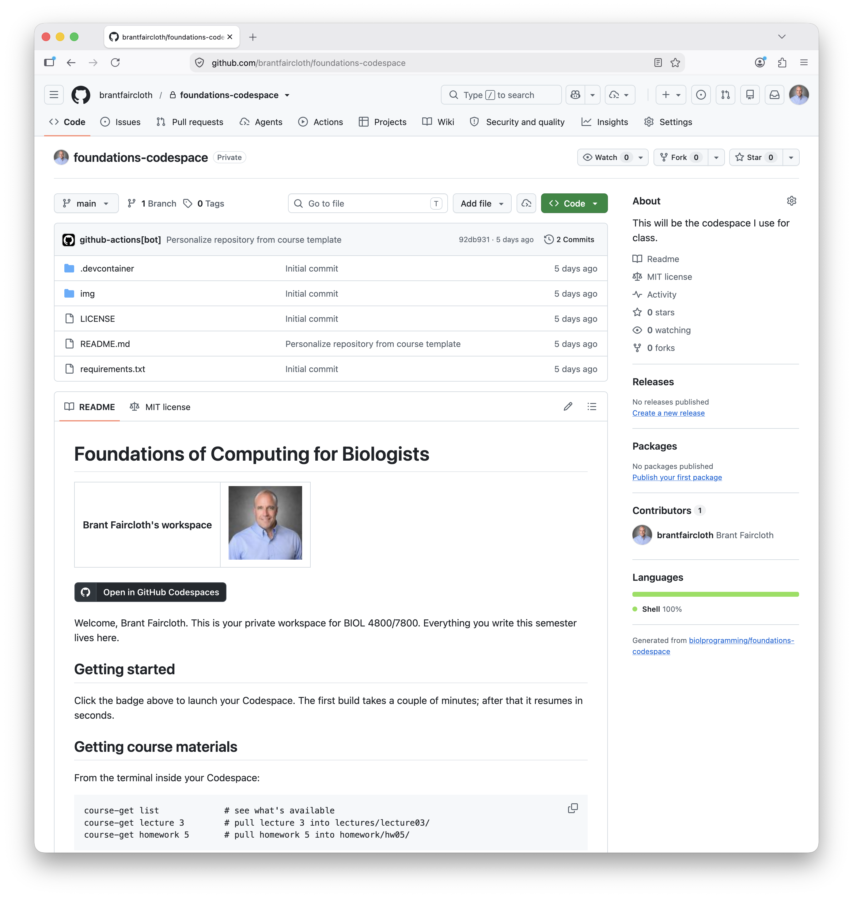
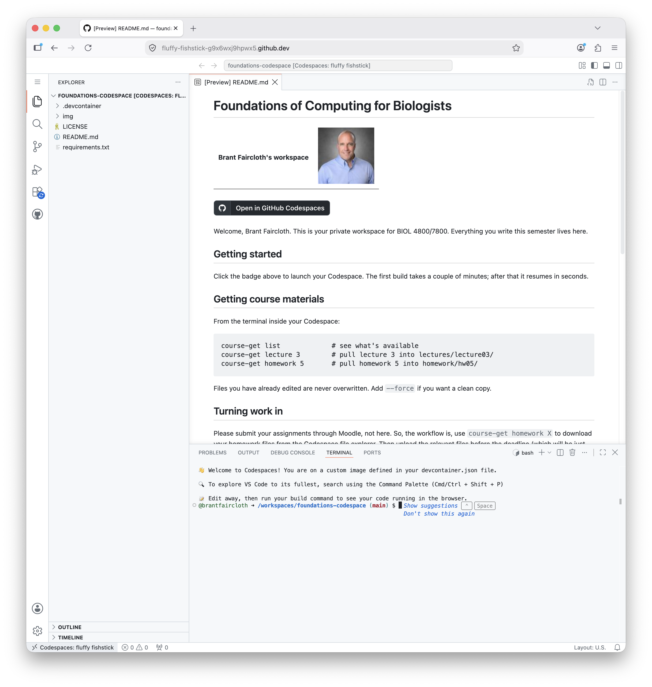

# Foundations of Computing for Biologists (BIOL2601/7800)
## Homework 00

## Assistance
* Instructor: Brant Faircloth (brant@lsu.edu)
* Office Hours:
    * See scheduling link on [Moodle][1]
* Graduate Teaching Assistant: Rujuta Vaidya (rvaidy2@lsu.edu)
* Office Hours:
    * See scheduling link on [Moodle][1]

[1]: https://moodle.lsu.edu

## Useful Links

* [Syllabus](https://github.com/biolprogramming/found-syllabus)
* [Schedule](https://github.com/biolprogramming/foundations-syllabus?tab=readme-ov-file#schedule) (Lecture slides)
* Your github codespace, where you can access additional lecture notes (using `course-get`)

## Getting course materials

From the terminal inside your Codespace:

```
course-get list             # see what's available
course-get lecture 0        # pull lecture 00 into lectures/lecture00/
course-get homework 0       # pull homework 00 into homework/hw00/
```

## Assignment

Remember to **follow instructions**.  See the [RUBRIC.md](RUBRIC.md) for scoring (and deductions).  This includes deductions for not following the instructions.

All answer files should be uploaded to Moodle.

1. Upload a screenshot of the github repository that we created during class to Moodle. It will look like the following:
  
2. Upload a screenshot of **your** codespace running in the cloud. It will look like the following:
  
