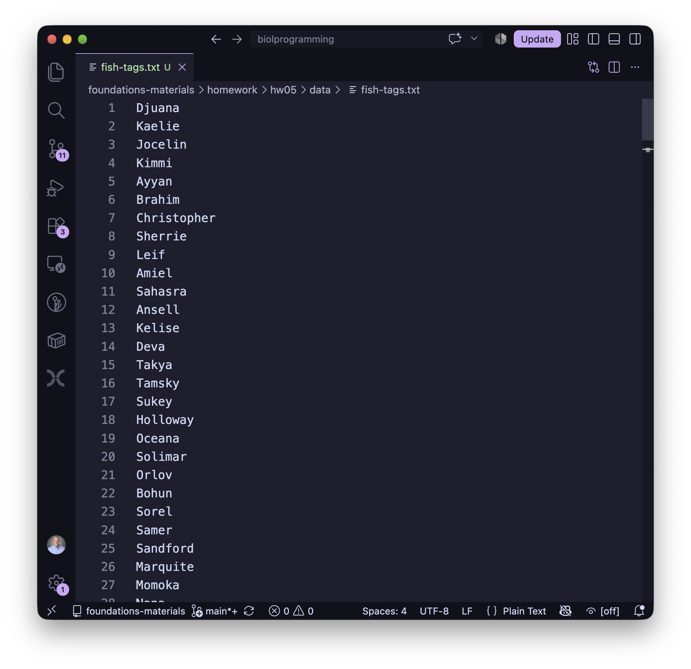
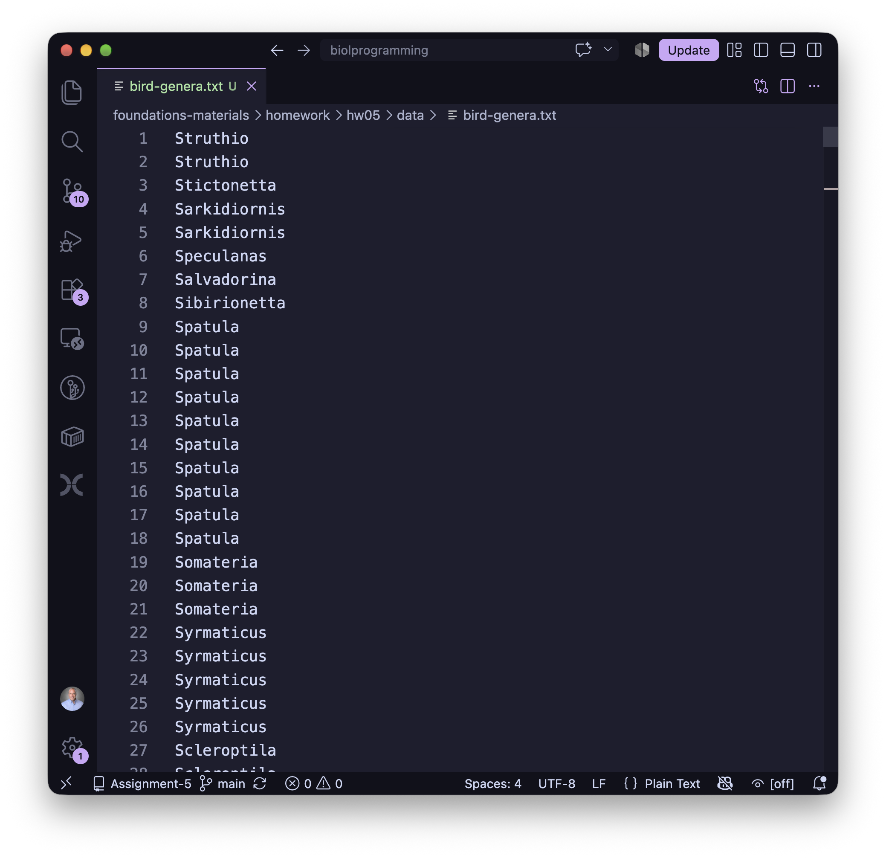

# Foundations of Computing for Biologists (BIOL2601/7800)
## Homework 05

## Assistance
* Instructor: Brant Faircloth (brant@lsu.edu)
* Office Hours:
    * See scheduling link on [Moodle][1]
* Graduate Teaching Assistant: Rujuta Vaidya (rvaidy2@lsu.edu)
* Office Hours:
    * See scheduling link on [Moodle][1]

[1]: https://moodle.lsu.edu

## Useful Links

* [Syllabus](https://github.com/biolprogramming/found-syllabus)
* [Schedule](https://github.com/biolprogramming/foundations-syllabus?tab=readme-ov-file#schedule) (Lecture slides)
* Your github codespace, where you can access additional lecture notes (using `course-get`)

## Getting course materials

From the terminal inside your Codespace:

```
course-get list             # see what's available
course-get lecture 0        # pull lecture 00 into lectures/lecture00/
course-get homework 0       # pull homework 00 into homework/hw00/
```

# Assignment

Remember to follow instructions. See the RUBRIC.md for scoring (and deductions). This includes deductions for not following the rules.


# Assignment

Remember to follow instructions. See the [RUBRIC.md](RUBRIC.md) for scoring (and deductions). This includes deductions for not following the rules.

You've been given `variants.tsv` which is in the `./data` directory and which is a tab-separated table of 2000 [single-nucleotide variants](https://en.wikipedia.org/wiki/Single-nucleotide_polymorphism) or "SNP calls" that have been identified across a population of Northern Bobwhites ([_Colinus virginianus_](https://en.wikipedia.org/wiki/Northern_bobwhite)). Columns in `variants.tsv` are: 1. `chrom`, 2. `pos`, 3. `ref`, 4. `alt`, 5. `qual`, 6. `depth`, 7. `maf`, 8. `gene`, 9. `effect`. These columns correspond to: (1) the chromosome on which the variant is found, (2) the position on that chromosome of the variant (in base pairs), (3) one of the two alleles, (4) the other of the two alleles, (5) a quality score, where higher numbers are better, (6) the depth of sequencing reads supporting this variant site, (7) the [frequency of the minor allele](https://en.wikipedia.org/wiki/Minor_allele_frequency) at this site, (8) the gene in which the variant was located (if it was located in a gene), and (9) the effect of the variant.

1. (5 pts) In a file named `question1.sh`, include the shebang and use `awk` to output the `chrom`, `pos`, `ref`, and `alt` columns for every variant on `chrZ` (which is the ["Z" sex chromosome](https://en.wikipedia.org/wiki/ZW_sex-determination_system)) to a new tab-separated (aka "tab-delimited") file named `filtered-snps.tsv`. **Ensure that the header is retained**.

2. (5 pts) The SNPs in `variants.tsv` are "raw" SNP data - meaning they have not been quality-controlled. The process of quality control or "filtering SNPs" is very important, because we want to try to remove SNP calls that might be incorrect. A variant or "SNP" usually **passes** filtering if `qual` is at least 30 and `depth` is at least 10. How many variants pass? How many fail? In a file named `question2.sh`, include the shebang and write an `awk` command (or commands) that outputs both counts in a way that is understandable to a regular human being... e.g. as in:
    ```
    # where X and Y are the actual values
    The number of SNPs retained is X.
    The number of SNPs dropped is Y.
    ```

3. (5 pts) Use the code you wrote for #2 to output the variants that **pass** the filters in question 2 to a new file. Then, in a file named `question3.sh` (that includes the shebang) write an `awk` command to process the file of passing variants, outputting to the screen the `chrom`, `pos`, `gene`, `effect`, and `maf` of those variants that are either `missense` or `stop_gained` and have a minor allele frequency (`maf`) below 0.05.

To make the rest of the assignment a little easier, I've already created the answer files for you.  In each of the questions below, you are asked to "find" and "replace" stuff. So, in the respective answer files, place whatever regular expression components are needed to find stuff on the "find" line and whatever components are needed to replace stuff on the "replace" lines.  Please place your answers after the colons.

4. (5 pts) In the file `data/fish-tags.txt` are some data you've collected in the field.  The data consist of columns that are separated by **tabs**.  There are 4 columns that correspond to:
    ```
    <name>  <tag>   <collection state>  <collection country>
    ```
    All the columns are consistent, particularly the tag column which is composed of 3 sets of 3 digits separated by hyphens "-". In the file named `question4.txt`, add the regular expression components that **find** all of the fish names and **replace** all of the remaining data so that only the names remain. What you should be left with is a list of fish names (only) that looks like the screenshot below.  The list should remain 300 items long.  **You must use regular expressions**.

    

5. (5 pts) In the file `data/bird-genera.txt` is a list of bird genera from the Clements Taxonomy. You saw this file in the last assignment. In the file named `question5.txt`, add the regular expression lines needed to **find** and **replace** all bird names so that the resulting list contains ONLY names that BEGIN with an "S".  The list should be 809 names long and the list should look like the screenshot below. **You must use regular expressions**.  

    _**Notice** that this is the exact same question I asked you in the last assignment, accomplished a totally different way._

    
